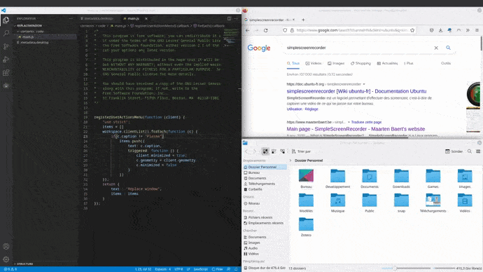

# Replace window



A KWin script that add to each window a menu that enables replacing the window with another one while keeping its geometry. Useful for keeping your actual windows management.

# Installation

## For the published version

You can search for Replace window in KWin Scripts then install the published version. You can also download the latest .kwinscript file in Releases and install it with KWin Scripts → Install from file.

## For the repo version (dev) :

Download the repo, and in the same folder as metada.desktop do :
```bash
plasmapkg2 --type=KWin/Script -i .
```
then activate the extension in KWin Scripts.